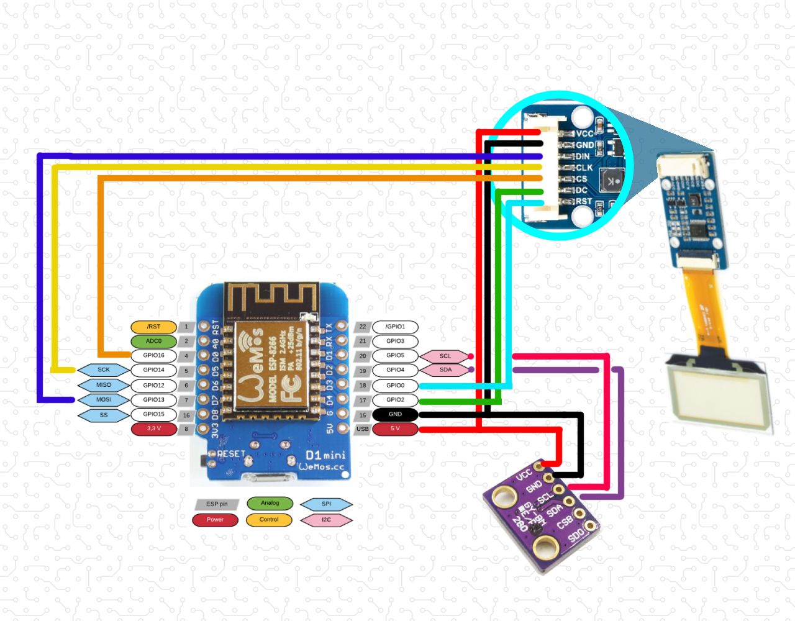

# SPI & I2C bus together. Waveshare transparent OLED display + BMP280 sensor

## Controller
Wemos D1 mini (ESP8266)

## Sensors
1. BMP280 (pressure & temp)

## Display
Waveshare transparent OLED display - [Waveshare transparent OLED display](https://www.waveshare.com/1.51inch-transparent-oled.htm "Transparent OLED display")

## Protocols

> The display works on SPI protocol.

> All the sensors works on I2C protocol.

## Connection diagramm
