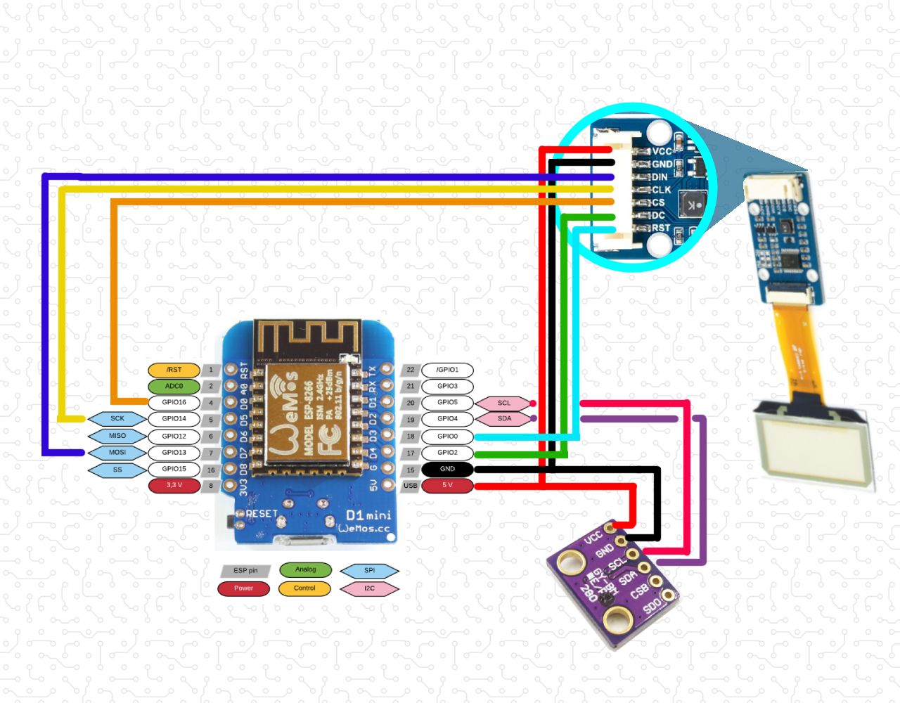

# car inclinometer project

## Controller
Wemos D1 mini (ESP8266)

## Sensors
1. MPU9250 with AK8963 (gyroscope, accelerometer, magnetometer)
2. BMP280 (pressure & temp)

## Display
Waveshare transparent OLED display

## Protocols

> The display works on SPI protocol.

> All the sensors works on I2C protocol.

## Connection diagramm
